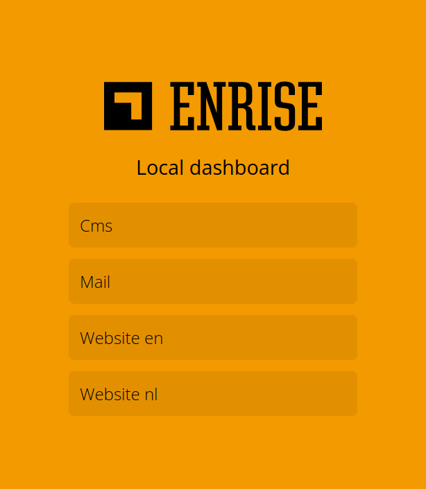
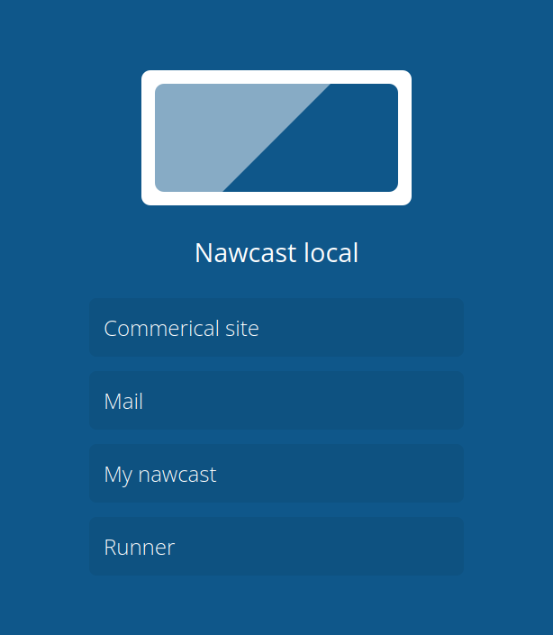
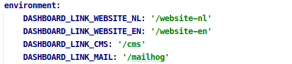
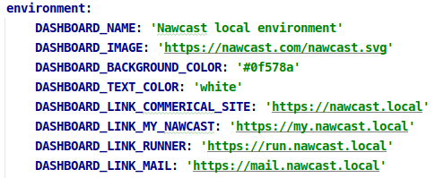

# App Dashboard

When running review applications in the cloud, it's possible that you're deploying multiple applications per
environment. Most deployment tools then only link to a single application URL, leaving you questioning what the other
application links could be.

No more, with the Enrise App Dashboard you add a simple dashboard page to your cloud within minutes, with just simple
adding some environment variables to configure it.

## Configuration

All configuration is done via environment variables. Add the desired configuration environment variables to your
container configuration.

| Environment variable         | Default value                 | Example                                      |
| ---------------------------- | ----------------------------- | -------------------------------------------- |
| `DASHBOARD_NAME`             | `"Dashboard"`                 | `"Acceptance environment"`                   |
| `DASHBOARD_IMAGE`            | The Enrise logo               | `"https://example.com/image.png"`            |
| `DASHBOARD_TEXT_COLOR`       | `"#000000"`                   | `"#ffffff"`                                  |
| `DASHBOARD_BACKGROUND_COLOR` | `"#f29a00"`                   | `"#000000"`                                  |
| `DASHBOARD_LINK_<name>`      | None, add as many as you want | `DASHBOARD_LINK_GOOGLE="https://google.com"` |

## Preview

| Default config                     | Custom config                       |
| ---------------------------------- | ----------------------------------- |
|  |  |
|     |     |

## Docker

The container uses port `8000` by default. In this example we will mount the web interface to port `3030` instead.

```shell
docker run --rm -ti \
    --publish 3030:8000 \
    --env DASHBOARD_NAME="Enrise production" \
    --env DASHBOARD_LINK_ENRISE="https://enrise.com" \
    enrise/dashboard:latest
```

## Docker compose example

```yml
services:
    dashboard:
        image: enrise/dashboard:latest
        ports:
            - '8000:8000'
        environment:
            DASHBOARD_NAME: 'Local dashboard'
            DASHBOARD_LINK_WEBSITE_NL: 'https://nl.example.local'
            DASHBOARD_LINK_WEBSITE_EN: 'https://en.example.local'
            DASHBOARD_LINK_CMS: 'https://cms.example.local'
            DASHBOARD_LINK_MAIL: 'http://localhost:8080'
```

## Kubernetes example

Running the dashboard container in kubernetes is easies with the kubernetes config. Open up the `kubectl deployment.yml` below.

<details>
  <summary>kubectl deployment.yml</summary>

```yml
apiVersion: apps/v1
kind: Deployment
metadata:
  name: dashboard
  labels:
    app: dashboard
  annotations:
    cluster-autoscaler.kubernetes.io/safe-to-evict: "true"
spec:
  replicas: 1
  strategy:
    type: Recreate
  selector:
    matchLabels:
      app: dashboard
  template:
    metadata:
      labels:
        app: dashboard
    spec:
      containers:
        - image: enrise/dashboard:latest
          name: dashboard
          imagePullPolicy: Always
          resources:
            requests:
              memory: "16Mi"
              cpu: "10m"
            limits:
              memory: "256Mi"
              cpu: "100m"
          startupProbe:
            httpGet:
              path: /
              port: 8000
            successThreshold: 1
            failureThreshold: 60
            periodSeconds: 3
          livenessProbe:
            httpGet:
              path: /
              port: 8000
            failureThreshold: 2
            initialDelaySeconds: 60
            periodSeconds: 60
          ports:
            - containerPort: 8000
          env:
            - name: DASHBOARD_NAME
              value: "Review application name"
            - name: DASHBOARD_LINK_WEBSITE_NL
              value: "https://nl.example.com"
            - name: DASHBOARD_LINK_WEBSITE_EN
              value: "https://en.example.com"
```

</details>

# Contributors

A big thanks to all the contributors!


